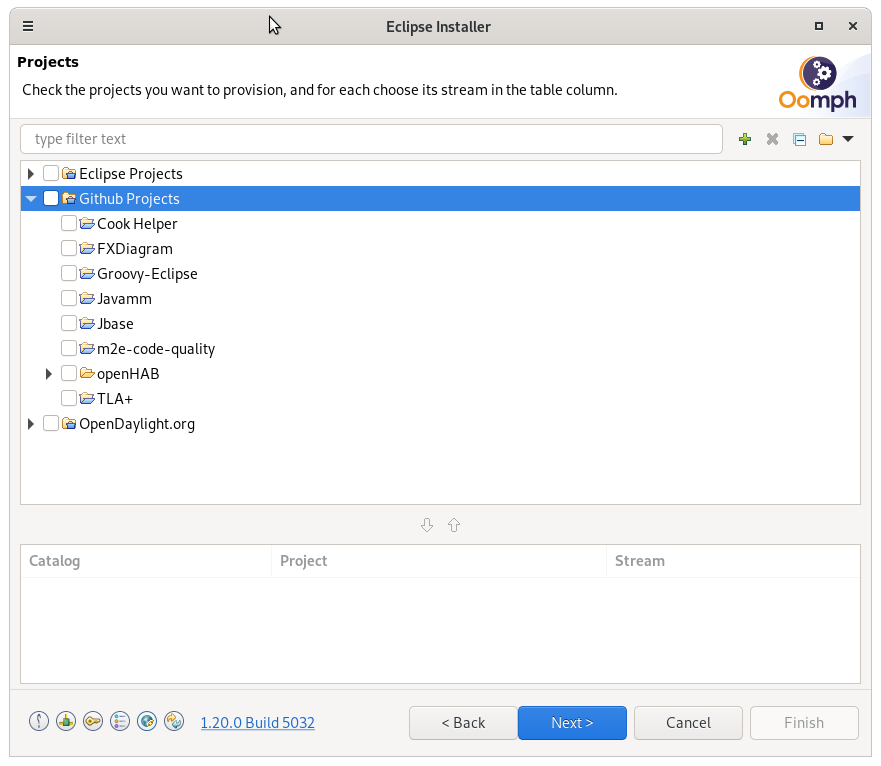
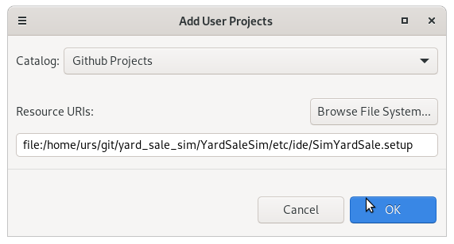
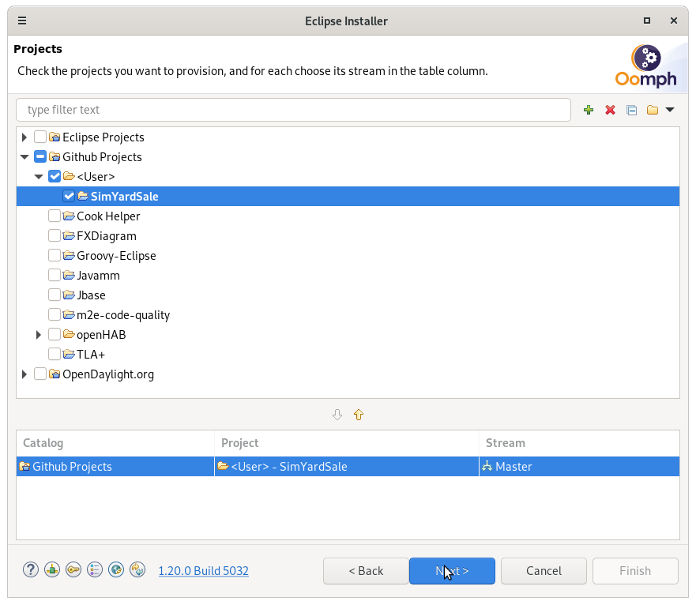
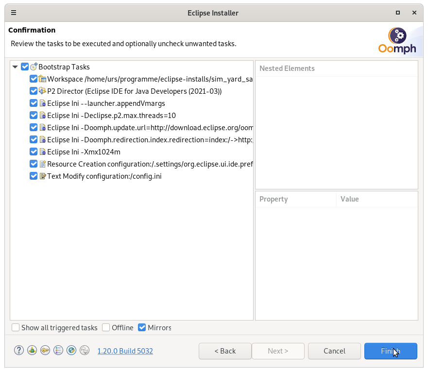
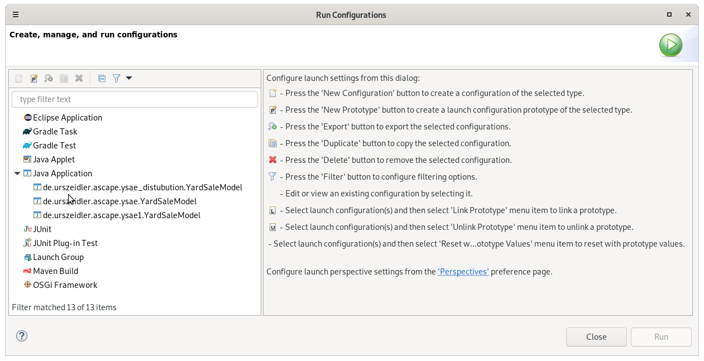

# Simple implementation of the Yard-Sale Model of Asset Exchange in economics

The sim uses the ascape api for agent based simulations. (http://ascape.sourceforge.net/)  
It uses the eclipse plugin mechanism to provide the classpath. So while you could also use any other ide to participate, using eclipse and the setup file is the easiest way to get started.  
The YardSaleSim is therefore an eclipse project, also a simple plugin, just receiving the ascape libraries as bundel dependencies. 

## installation 

To use and try the sim, use the eclipse installer and the [SimYardSale.setup](https://raw.githubusercontent.com/UrsZeidler/yard_sale_sim/master/YardSaleSim/etc/ide/SimYardSale.setup) Oohmp setup, which will install and configure a eclipse installation, and checkout the code and import it.

Download the [installer](https://wiki.eclipse.org/Eclipse_Installer), get the setup file and install.  
Switch to advanced mode. On the first page (product selection), choose whatever product your eclipse should be based upon. On the second page, you can drag your [SimYardSale.setup](https://raw.githubusercontent.com/UrsZeidler/yard_sale_sim/master/YardSaleSim/etc/ide/SimYardSale.setup) file from the system explorer onto the “eclipse.org” top node. Double click it, so that it is shown in the three lists below or selected it from the filesystem.

add the setup file  

select the setup  

finish the installation  

After installing the eclipse the installer will clone the repository and setup the workspace and you are ready.

## executing the simulation

For each model there is a java starter you can use to execute the specific model.  

These simply calls the ascape swing application and provides the model to run. For more see the ascape documentation.

## develping

All the basic behavior are collected in the abstract classes, so you only need to extend from them.  
The model collects the basic data for the algorithm and the Agent instance. While the agent implements the algorithm.

Model:  
* protected abstract AbstractYardSaleAgent createAgent();

Agent:  
* public void play(Agent agent);

## others